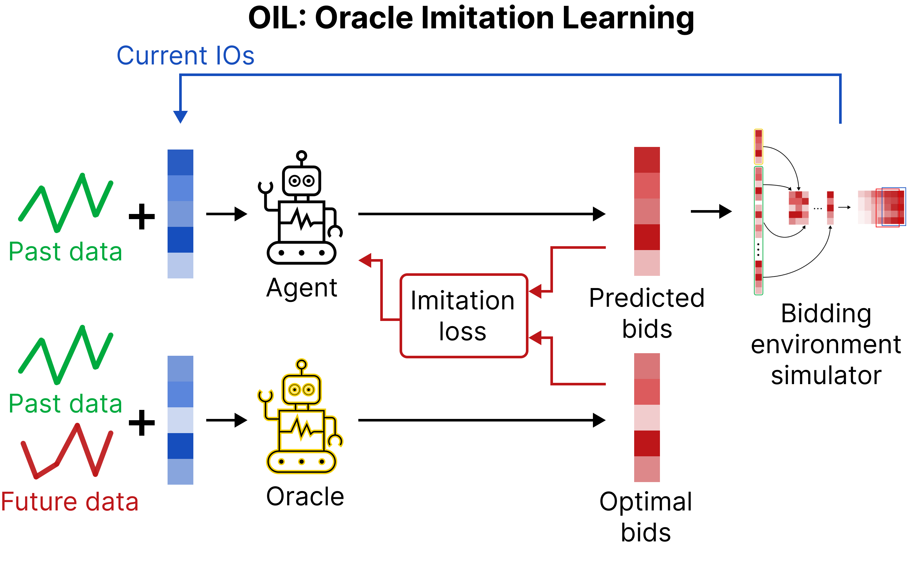

# OIL: Auto-Bidding in Real-Time Auctions via Oracle Imitation Learning

Official implementation of OIL, the algorithm introduced in **Auto-Bidding in Real-Time Auctions via Oracle Imitation Learning**, Chiappa, A.S., Gangopadhyay, B., Wang, Z., Takamatsu, S. (2024). In OIL, an auto-bidding agent learns to mimic the bids of an perfectly knowledgeable *oracle* policy, to navigate the uncertainty of advertisement campaigns.



The most important parts you might be interested in are:

* The advertising **campaign simulator environment**. It is a Gymnasium envinonment which leverages the advertisement traffic from the **Alibaba dataset** to simulate a real-time bidding auction. It is the class `BiddingEnv` implemented at `online/envs/bidding_env.py`
* The **oracle algorithm**. It is the greedy heuristic to solve the multiple-choice knapsack problem (MCKP) whose solution is a near-optimal bidding strategy, based on complete campaign information. The **oracle-slot** and the **oracle-upgrade** algorithms are implemented within the methods `get_oracle_slot_action` and `get_oracle_upgrade_action` of `BiddingEnv`.
* **OIL**, which subclasses the `OnPolicyAlgorithm` class of **Stable Baselines 3** and is thus compatible with the many code bases using this reinforcement learning library. It is implemented at `online/algos/oil.py`
* Preatrained checkpoints. The folder `pretrained` included all the checkpoints used for the evaluation of OIL and of the baselines

In the following sections we explain how to reproduce the training experiments and evaluate the policies.

## Dependencies

To run the code, you can either create a **Conda environment** or a **Docker container**. To create a conda environment, simply run:

```bash
conda create -n oil python=3.9.12 pip=23.0.1
conda activate oil
pip install -r requirements.txt
```

If you prefer running the code in a Docker container, you can create an image using the provided dockerfile:

```bash
docker build -t oil:latest -f ./Dockerfile .
```

## Download the dataset

The script `download.sh` downloads and unzips the traffic data for all the 21 periods of both Alibaba-dense and Alibaba-sparse. Simply run:

```bash
sh download.sh
```

The csv files containing the traffic data are organized in subfolders of `data/traffic/raw_traffic_dense` and `data/traffic/raw_traffic_sparse`. Please move all of the csv files to `data/traffic/raw_traffic_dense` and `data/traffic/raw_traffic_sparse`, respectively. You can delete the zip files and the rest of the content.
The csv format makes the read and write operations on the dataset relatively slow. Therefore, we have prepared a simple script to save the files in parquet format.
You can run:

```bash
python csv_to_parquet.py
```

This script will create the new folders `data/traffic/raw_traffic_dense_parquet` and `data/traffic/raw_traffic_sparse_parquet`, with the converted traffic data.

## Preprocess the dataset to use it in BiddingEnv

`BiddingEnv` accepts two separate datasets per period, one including the traffic of impression opportunities over time, and another one with the bids of each advertiser for each impression opportunity. This representation reduces the amount of memory necessary for the environment to simulate advertisement campaigns. It also allows to easily change the bids of the competitors, to test how the auto-bidding agent deals with different situations. To create the two datasets for each period, run:

```bash
python bidding_train_env/dataloader/online_rl_data_generator.py
```

The traffic data will be in the corresponding folder at `data/traffic`.

## Training with OIL

We have prepared some scripts to replicate the training experiments of OIL. They are in the folder `train_scripts`. For example, to train **OIL-slot** in the **Alibaba-dense** dataset, run:

```bash
sh train_scripts/train_oil_slot_dense.sh
```

You can customize the training by changing the parameters in the script. The complete list of hyperparameters can be found at `online/main_train_oil.py`.

During training, checkpoints will be periodically saved at `output/training/ongoing`, together with the configuration files of the training run.

## Test a trained agent

The folder `test_scripts` provides executables to test the performance of pre-trained agents in the simulation environment. For example, to test the **OIL-dense** agent (seed=0) you can run:

```bash
sh test_scripts/test_oil_slot_dense.sh
```

The pre-trained OIL agents are in the `pretrained` folder. We will separately upload the checkpoints of the baselines, as they are too large to be shipped with this repository.

## Baselines

The code in the folders `online` and `offline` can be used to train and test all the agents we have used as baselines (LP, BC, IQL, PPO).
